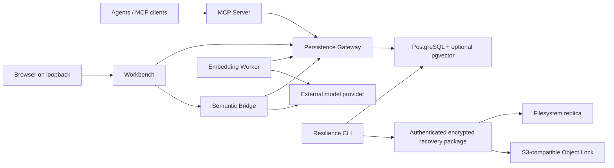

<p align="center">
  
</p>

# FORGE

**Durable, project-scoped memory and semantic retrieval for AI agents and developer tools.**

[](https://github.com/ProjForge/Forge/actions/workflows/ci.yml)
[](LICENSE)
[](https://www.postgresql.org/)
[](https://nodejs.org/)

FORGE is a provider-agnostic persistence layer for durable project knowledge.
It gives agents and humans one relational source of truth for memories,
decisions, documents, executions and auditable context, with optional vector
retrieval through pgvector.

FORGE is not an agent framework and does not call an embedding model from its
core. Model providers remain replaceable external workers.

The official geometric identity and usage rules live in the
[brand pack](assets/brand/BRAND_GUIDE.md).

> **Project status:** alpha. The schema and local Workbench are validated on
> PostgreSQL 18.4 with pgvector 0.8.2; PostgreSQL 14+ is the compatibility
> target. APIs may evolve before 1.0.

## Why FORGE

- **Project isolation:** relational and semantic reads cannot cross projects.
- **Database-enforced invariants:** optimistic locking, append-only history and
  managed identity rules survive application bugs.
- **Provider independence:** embeddings and reranking stay outside Core.
- **Agent and human access:** MCP tools and a loopback-only local Workbench use
  the same Gateway contracts.
- **Reproducible evolution:** transactional, checksum-aware migrations and
  idempotent write contracts.
- **Verified recovery:** authenticated encrypted backups restore only into an
  empty database and prove migration checksums and table counts afterwards.
- **Project portability:** onboard existing repositories from a conservative
  documentation allowlist or move checksummed project state between FORGE
  installations without replaying fabricated operational history.

## Components

| Package | Current version | Responsibility |
| --- | ---: | --- |
| `schema` | 0.1.3 | PostgreSQL migrations and invariant tests |
| `persistence-gateway` | 0.1.5 | Typed transactions and domain workflows |
| `mcp-server` | 0.1.5 | Strict stdio MCP adapter |
| `embedding-worker` | 0.1.6 | Provider-pluggable indexing worker |
| `semantic-bridge` | 0.1.4 | Natural-language search and optional reranking |
| `resilience` | 0.4.0 | Encrypted logical/physical recovery, immutable replication and safe restore |
| `workbench` | 0.2.0-rc.4 | Local human-facing web application |

## Architecture



See [Architecture](docs/ARCHITECTURE.md) and the
[decision records](docs/decisions/) for boundaries and trade-offs. The
[project portability guide](docs/PROJECT-PORTABILITY.md) documents repository
onboarding and the `.forge-project` format.

## Quick start for contributors

Prerequisites: Node.js 20+ and npm 10+.

For the guided Windows installation, start with the non-mutating plan in the
[Windows bootstrap guide](docs/INSTALL-WINDOWS.md).

TencentDB for PostgreSQL has a dedicated, fail-closed Core compatibility gate.
It remains uncertified until the [provider gate](docs/TENCENTDB-COMPATIBILITY.md)
passes on an isolated instance through a private VPC runner.

```bash
git clone https://github.com/ProjForge/Forge.git
cd Forge
npm install
npm run build
npm test
```

The default test suite uses an embedded PostgreSQL-compatible runtime where
possible and does not require credentials. Native PostgreSQL, pgvector and LM
Studio validation are opt-in; see each package README:

- [Schema and migrations](packages/schema/README.md)
- [Persistence Gateway](packages/persistence-gateway/README.md)
- [MCP Server](packages/mcp-server/README.md)
- [Embedding Worker](packages/embedding-worker/README.md)
- [Semantic Bridge](packages/semantic-bridge/README.md)
- [Resilience](packages/resilience/README.md)
- [Workbench](packages/workbench/README.md)
- [Raspberry Pi 5 ARM64 acceptance](docs/RASPBERRY-PI-5-ACCEPTANCE.md)

Raspberry Pi 5 Model B Rev 1.1 has passed the complete optional ARM64 technical
acceptance gate on Debian 13. This is a verified test platform, not a runtime
dependency or a claim of support for every ARM64 distribution.

## Security model

FORGE treats PostgreSQL as the source of persistent truth. The Workbench binds
only to loopback, keeps database credentials out of browser state and places
all writes behind Gateway validation and idempotency contracts. Never expose
the local Workbench directly to a network.

Please report vulnerabilities using the process in [SECURITY.md](SECURITY.md).
Official binaries follow the [code signing policy](docs/CODE_SIGNING_POLICY.md).
FORGE does not collect telemetry; network and local-data behavior is documented
in the [privacy policy](PRIVACY.md).

## Contributing

Read [CONTRIBUTING.md](CONTRIBUTING.md) before proposing changes. New behavior
must preserve the invariants documented in [Architecture](docs/ARCHITECTURE.md)
and include tests at the narrowest useful boundary.

## License

Licensed under the [Apache License 2.0](LICENSE).
